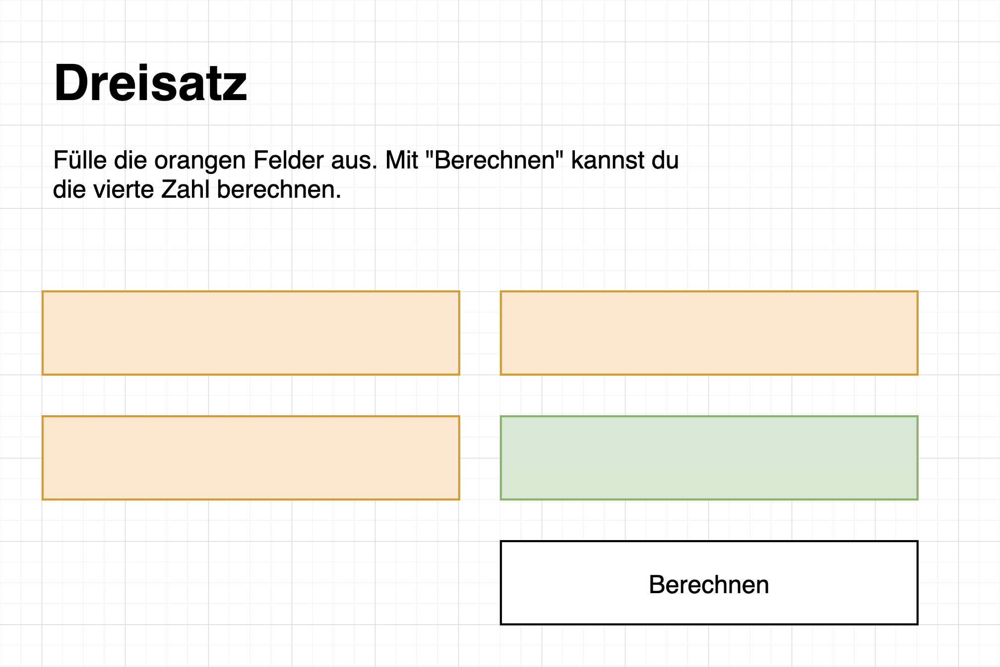

# Web: Das erste Webprojekt

| [zurück](./5-Javascript-Grundlagen.md) | [vorwärts][1] |
| --- | --- |

## Einstieg

Wie bereits erwähnt, macht es Sinn dass wir zuerst überlegen, was wir umsetzen möchten.
So können wir dann ausarbeiten, was wir für das Projekt alles benötigen.

## Idee

Wir programmieren einen Dreisatzrechner.

## Wie funktioniert der Dreisatz?

Mit dem Dreisatz können wir von 2 zusammenhängenden Werten den zusammenhängenden Wert einer dritten Zahl berechnen:

| `20` | `80` |
| --- | --- |
| **`10`** | **`x`** |

Das Verhältnis von `20` zu `80` ist gleich wie das Verhältnis von `10` zu `x`.

---

## Elemente

- Welche Elemente benötigen wir für die Umsetzung vom Dreisatz?
- Was für Elemente eignen sich am Besten?

 **Lösungsvorschlag** 

- Titel: `<h1>`
- Eventuell Text für Erklärung: `
`
- Drei Felder für die Eingabe der drei Zahlen: `<input>`
- Ein Feld für die Lösung: `
` oder `<input readonly>`
- Ein Knopf, damit die Berechnung startet: `<button>`

Bei dieser Aufgabe gibt es nicht die eine Lösung. Aber immer einen Lösungsvorschlag.

---

## Skizze

- Zeichne eine kleine Skizze, wie die Elemente dargestellt werden sollen

 **Lösungsvorschlag** 

Bei dieser Aufgabe gibt es nicht die eine Lösung. Aber immer einen Lösungsvorschlag.

PS: Diese Skizze habe ich mit dem Tool [app.diagrams.net](https://app.diagrams.net/) gezeichnet. 

---

Wir wissen also nun, was wir umsetzen möchten. Lass uns mit dem [Grundgerüst][1] starten: [Schritt 7: Grundgerüst][1]

[1]: 7-Grundgeruest.md
